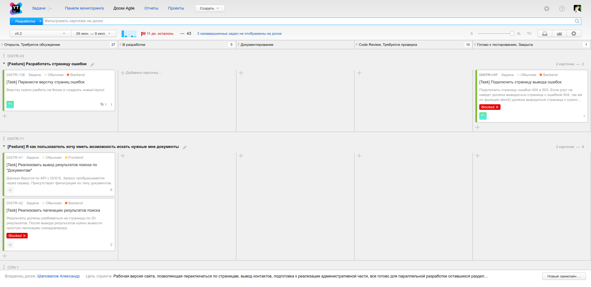

## Youtrack

##### <span style="font-family:Helvetica Neue; font-weight:bold">Все что вам нужно знать о том как <span style="color:red">эффиктивно</span> использовать task tracker</span>

+++

## Трекер задач для разработчиков

- Расширенный текстовый поиск (сохраненные поиски)
- Пакетное редактирование                  |
- Клавиатурная навигация                   |
- Настраиваемые поля                       |
- Настраиваемый workflow с помощью JS      |
- Панели мониторинга                       |
- Отчеты                                   |

+++

#### Документация

<span style="font-family:Helvetica Neue; font-weight:bold font-size:15px">https://www.jetbrains.com/help/youtrack/standalone/2017.2/YouTrack-Documentation.html</span>

<span>Учим английский</span ;)    |


+++

#### Поиск

---?image=youtrack/search-1.png&size=auto


---

## Типы задач
 
+++

#### Feature

- Укладывается в спринт                                                           |
- Если не укладывается в спринт, или видно что будет висеть долго - сливаем в dev |
- Всегда имеет подзадачи                                                          |
- Всегда имеет ответственного                                                     |
 
+++ 

#### Задача
 
Объем работ связанный с добавлением нового функционала

- Может быть как подзадачей у feature так и самостоятельной еденицой работы  |
 
+++

## Статусы (состояния задачи)


+++

#### В обработке

Требования к задаче находятся в процессе уточнения и формализации лицом-постановщиком задачи

+++
#### Отменена

Задача может быть отменена по различным причинам на любом этапе

+++

#### Требуется обсуждения

- Задача может перейти в данное состояние на любом этапе рабочего процесса
- Задача не может перейти в иное состояние до окончания обсуждения и прихода к общему согласию по ее требованиям

+++

#### Открыта

Требования по задаче сформированы или изменены, задачу можно брать в работу (при условии попадания в спринт)

+++

#### В разработке

Выставляем этот статус сразу же когда берем задачу в исполнение

+++

#### Документирование

Почти к любой задаче можно написать документацию. Ведем в папке docs

<span style="font-family:Helvetica Neue; font-weight:bold font-size:20px">https://gitlab.kodeks.ru/kodeks/guidelines/blob/master/workflow/documentation.md</span>

<span style="font-family:Helvetica Neue; font-weight:bold font-size:20px">https://docsify.js.org/<span>

Любой метод или параметр должны вести туда где были созданы.

```php
/** @var MyClass $variable */
$variable = $this->getTheAnswerToLifeTheUniverseAndEverything();
```

+++

#### Code Review

Задача должна быть проверена другими разработчиками
<span style="font-family:Helvetica Neue; font-weight:bold font-size:20px">https://gitlab.kodeks.ru/kodeks/guidelines/blob/master/workflow/code-review.md</span>

+++

#### Готово к тестированию

Задача готова что бы ее посмотрели тестеры (СКК)

+++

#### Закрыта

Задача прошла все стадии развития и является выполненной и завершенной


---

## Управление Agile проектами



+++

## Scrum

1. Доска задач
2. Не ограниченное число проектов на доске
3. Планирование спринтов

+++

## Наш Scrum
#### Термины

1. Backlog - Накапливаемый список задач (на спринт берем только часть)
2. Sprint - итерация
3. User Story - особый вид описания задачи от лица пользователя

+++

#### Правила

- Понедельник - старт спринта
- Sprint - 2 недели                                                         |
- На Sprint берем  features которые можно детализировать во время спринта   |
- Комманда разработки не берет ВНЕЗАПНЫЕ задачи                              |
- В конце спринта должны получить "рабочий" продукт                         |
- В конце спринта должны получить обратную связь от заказчика (менеджера)   |

+++

#### Разделение команды на разработку и поддержку

1. Команда разработки работает по спринту
2. Команда поддержки учавствует в спринте если нет работы, но в основном занимается "техническим долгом"
3. Разделение условное и существует пока у нас много legacy. При успешном введении agile разделения не будет.